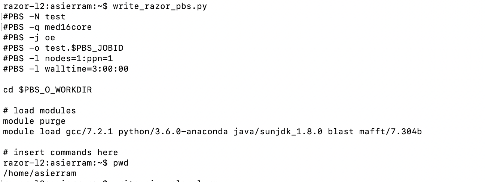

# BIOL5153

### **Assignment's repository**
#### Assignment 2
**[CV_AndreaSierra.md](https://github.com/asierram/BIOL5153/blob/main/CV_AndreaSierra.md)** - Markdown formatted CV

#### Assignment 3
**[assn03.tgz](https://github.com/asierram/BIOL5153/blob/main/assn03.tgz)** contains all the file regarding the remote computing assignment. 

#### Assignment 4

Python scripts called **[write_pinnacle_slurm.py](https://github.com/asierram/BIOL5153/blob/main/write_pinnacle_slurm.py)** and **[write_razor_pbs.py](https://github.com/asierram/BIOL5153/blob/main/write_razor_pbs.py)**

**PBS**: Screen shot that shows the pwd and script commands, followed by the output of the script

**SLURM**: Screen shot that shows the pwd and script commands, followed by the output of the script

#### Assignment 5

**[nucleotide_composition.py](https://github.com/asierram/BIOL5153/blob/main/nucleotide_composition.py)**: This python script provides nucleotide composition statistics for a provided sequence

#### Assignment 6
**[parseGFF.py](https://github.com/asierram/BIOL5153/blob/main/parseGFF.py)** : This script extracts a feature in a .gff file from a larger genomic FASTA sequence and prints it to standard out